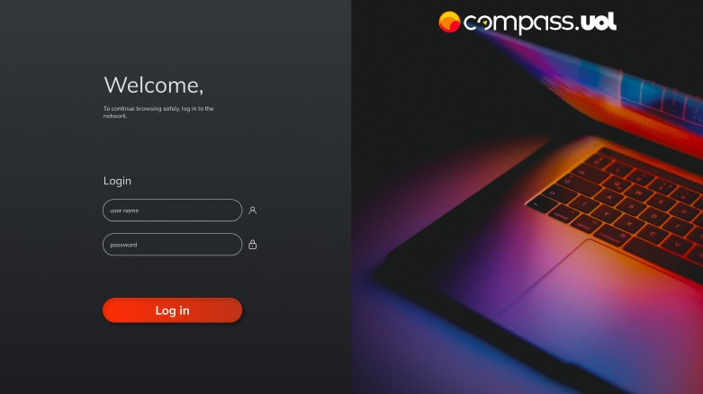

<h1 align="center">
  Weekly Planner
</h1>

  
  
  <a href="https://weekly-planner-a8b5-m9ukvkd3e-william-klein7.vercel.app">Para acessar o site, clique aqui</a>
  <h6>
    Obs: O Planner foi desenvolvido para a resolução 1920x1080
  </h6>

## 📔 Sobre
O Weekly Planner é uma ferramenta de planejamento poderosa e intuitiva que ajuda você a organizar sua vida de forma eficiente, garantindo que você esteja no controle de suas tarefas e metas ao longo da semana. Seja para uso pessoal, acadêmico ou profissional, o Weekly Planner oferece uma maneira prática de visualizar suas atividades semanais.

O Weekly Planner fornece uma visão completa da sua semana de uma só vez. Com uma interface de calendário intuitiva, você pode ver todos os dias da semana de forma clara e organizada.

Registre todas as suas tarefas, compromissos e metas para a semana. Atribua datas de vencimento e prioridades para garantir que você esteja focado no que é mais importante.

Organize sua semana de forma eficaz com o Weekly Planner. Nunca foi tão fácil manter o controle das suas tarefas e compromissos. Experimente agora e simplifique sua vida semanal!

## 🔨 Ferramentas
- [React](https://legacy.reactjs.org/docs/getting-started.html)
- [CSS](https://developer.mozilla.org/en-US/docs/Web/CSS)
- [JavaScript](https://developer.mozilla.org/en-US/docs/Web/JavaScript)

## 💡 Contribuição
Se você deseja fazer contribuições ou adicionar recursos ao projeto, não hesite em fazer um fork do repositório, fazer suas alterações e enviar um pull request.
